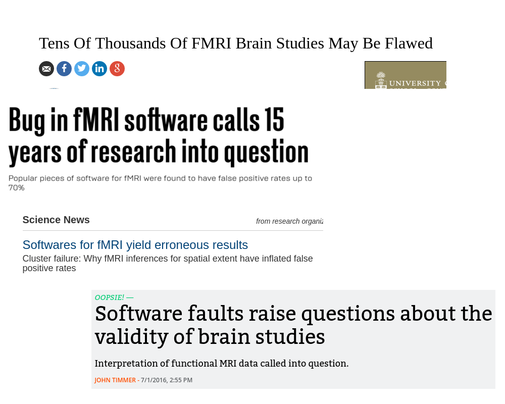
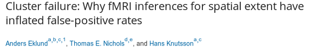
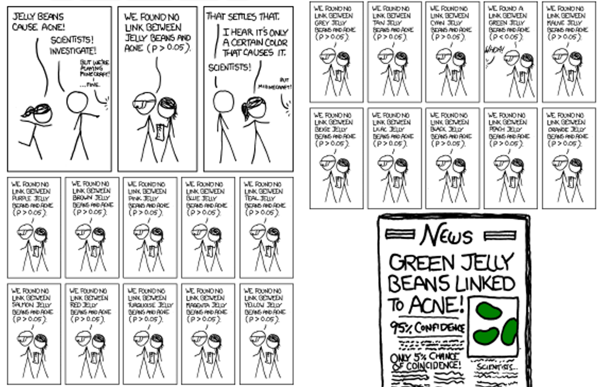
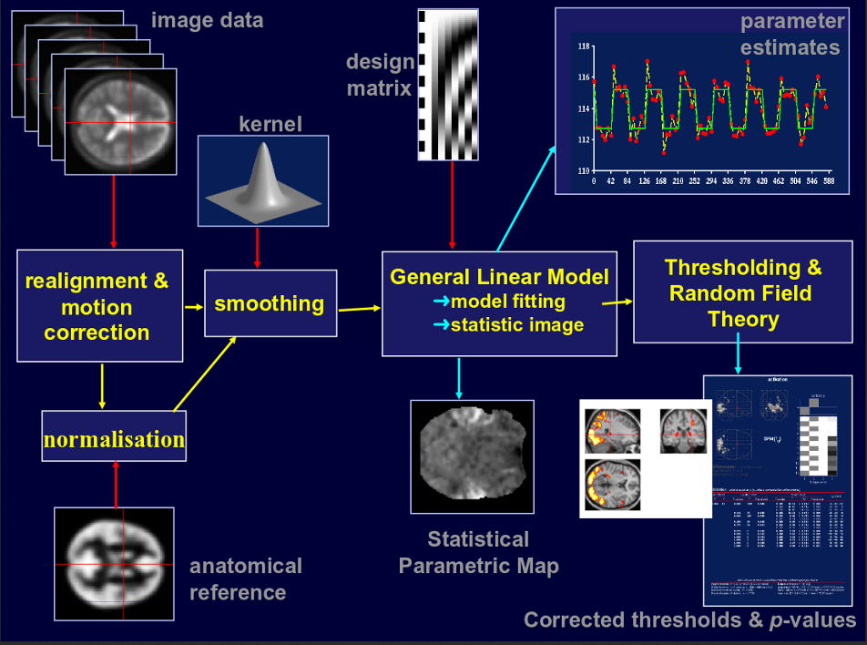
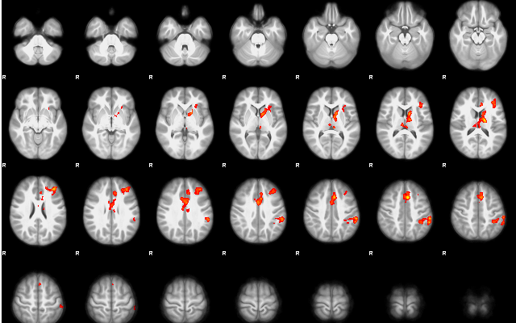
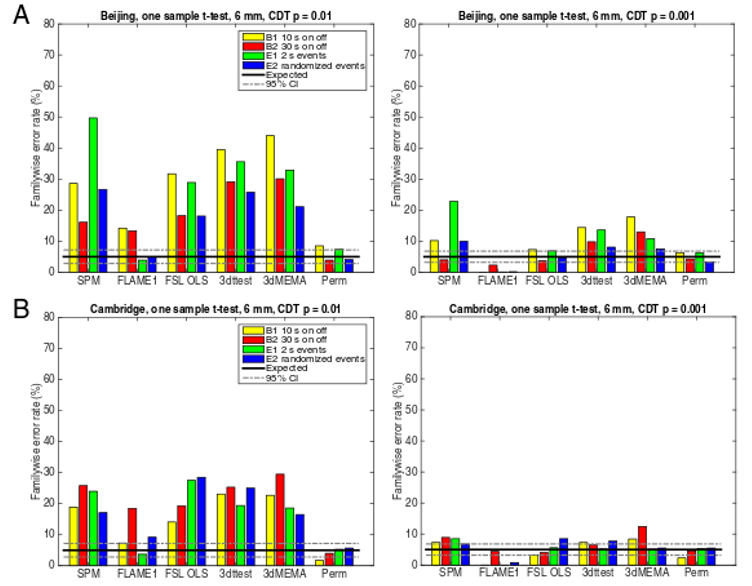
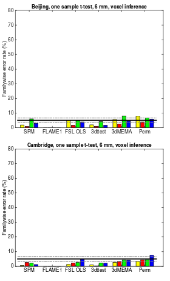

```{r setup, include=FALSE}
knitr::opts_chunk$set(echo = TRUE)
```

---



---



## So What Happened

- Eklund, Nichols, and Knutsson demonstrated standard fMRI statistical inference has badly inflated false
positives rates
- Makes you wonder if exciting brain region X responding to stimulus Y finding was just a cherry-picked 
false positive.
- Highlighted that due to non-reproducible workflows, and poor data sharing, many of these finding could never be repeated with valid inference.

## How Did We Get Here

- fMRI is challenging to analyze
- Preprocessing steps widely used as black boxes
- Desire to use spatial information to determine signal significance
- Improperly specified models of spatial noise
- Ultimately a multiple testing problem

## Multiple Comparisons

[^1]

[^1]: Borrowed from XKCD

## Multiple Comparisons

- As with most imaging analysis, multiple comparisons is significant concern
- Solutions:
    1. Bonferroni: control your type one error rate by multiplying your p-values
       by the number of tests. This is equivalent to setting your type one error
       rate to $\alpha/n$ 
    2. FDR (Benjamini-Hochberg): Order your p-values lowest to highest and set $p_{corr} = \frac{pn}{rank(p)}$
    3. FDR (Variants): Assume p-values come from two distributions, a true finding
       distribution peaked near zero, and a uniform distribution. 
- But in low power situations with high covariance between voxels, these can be conservative
  
## Correction To The Paper

> The authors note that on page 7900, in the Significance Statement, 
> lines 9–11, "These results question the validity of some **40,000** fMRI 
> studies and may have a large impact on the interpretation of neuroimaging results"
> should instead appear as "These results question the validity of a number of fMRI studies
> and may have a large impact on the interpretation of weakly significant neuroimaging results."

Nichols goes on to say on his blog, the number is closer to 15,000 with an additional 13,000
papers using *no multiple comparison correction at all*

## About Group Comparisons Task-Based fMRI

- Most fMRI seeks to measure brain activity by blood flow
- Blood oxygen level dependent (BOLD) contrast
- A time-series of volumes are acquired for each subject
- Stimuli are presented to the subject throughout the time series
- The BOLD signal is modelled as a function of the stimuli
- The statistical associations of the BOLD contrast to the stimuli are compared across groups
- Group comparisons typically simple t-tests and ANOVAs

## Why Is This Tough

- Subjects move: 
    - within subject each fMRI volume must be aligned to each-other 
    - these must be aligned to a corresponding anatomical scan 
    - these must be registered to a common space
- BOLD signal is sluggish
    - ~ 2 seconds to start 
    - ~ 4-6 to peak 
    - ~ 10 to return to baseline 
  so the stimulus time series is convolved with a function to match this behaviour
- Analyzing time series comes with it's own statistical challenges
    - how do we model temporal autocorrelation
    
---

^[Borrowed from Nichols (2010)]


## Enter Spatial Models

- Signals with large spatial extent are probably more likely to be real than individual high intensity
- Question becomes, how do we analyze spatial extent, and how do we correct for multiple comparisons?
- First: Threshold your data at threshold that sounds appealing (p < .01, and p < .001)
- Then: Use random field theory (RFT) results to assign a 
  p-value to clusters based on their size
  
---



  
## The Problems

- When statistics maps aren't smooth enough, RFT p-values are biased (2003)
- RFT typically assumes a stationary noise distribution (same noise over the brain) which
  is often invalid (2004)
- Together these problems can lead to 70% FWE rates in single subject analyses (2012)

## The Paper

- In order to assess how much these problems matter for group comparisons, check the null distribution
- The authors took a large open data set with a pool of neurotypical subjets, and randomly sampled 
  groups to compare
- If after processing and multiple comparison correction any clusters in the brain were significant that
  test was a false positive (error).
- The distribution for a two group difference should be Student's t distribution, and after bonferroni
  correction, the expected proportion of errors should be 5%
- Higher error rates imply the multiple comparison correction is insufficient.
- Five analysis functions from the three most popular fMRI software packages were compared to their
  non-parametric alternative

---



## The results

- All parametric tools produce FWE higher than 5%
- Situation is more extreme when cluster defining thresholds are high (FWE rates ~20-40)
- Different data sets are affected differently (Beijing less affected than Cambridge)

---

\centering 

## So What To Do

- Give up on cluster inference
- Use a bootstrap/randomization test instead of RFT
    1. Shuffle group membership and covariates between subjects 
    2. Refit your model
    3. Create a distribution on largest clusters per sample
    4. Assign p-values to cluster size from this null distribution
- Merge voxel level data with cluster extent (Threshold free cluster enhancement)
    1. Shuffle group membership and covariates between subjects
    2. Refit your model
    3. Perform TFCE
    4. Create a randomization of the cluster enhanced statistics
    5. Assign p-values to voxels from this null distribution
    6. Correct with Bonferroni or FDR
    
---

## Revisiting The Implications

- 15,000 papers use RFT based cluster inference
- Of these 3,500 use a CDT of p = 0.01, which is only 10% of the literature
- A randomization test may lead to a 2-3 order of magnitude increase in p-value
  this likely leaves many highly significant results intact.
- So maybe not quite as damning as the sensational headlines suggest

## Are We Safe?

- 

\centering{\large{Questions and Discussion}}

  